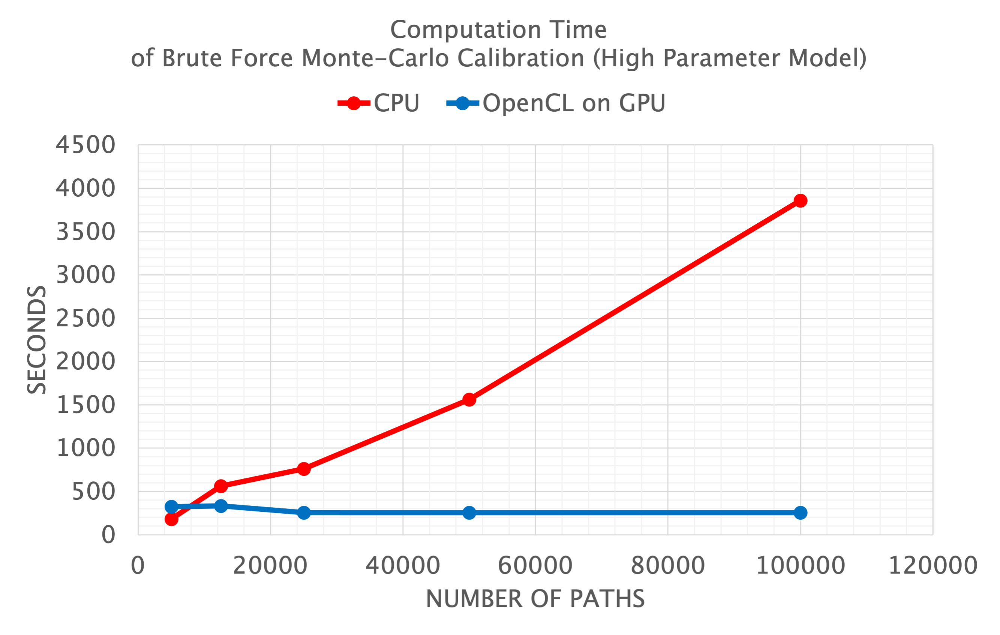

finmath lib opencl extensions
==========

Project home page: https://finmath.net/finmath-lib-opencl-extensions

****************************************

**Vector class (RandomVariable) running on GPUs using OpenCL.**

**Enabling finmath lib with OpenCL (via jocl). - Running finmath lib models on a GPU.**

****************************************

The *finmath lib opencl extensions* provide an OpenCL implementation of the [finmath lib](http://finmath.net/finmath-lib/) interfaces `RandomVariable` and `BrownianMotion` compatible with finmath lib 5.1 or later
(tested on GRID GPU Kepler GK105, GeForce GTX 1080, GeForce GT 750M, AMD Radeon Pro 560, Apple M1).

For Cuda support see finmath-lib-cuda-extensions.

Performance Characteristics
-------------------------------------



The current implementation uses very small OpenCL kernels which affects the performance. This may be optimized quite straight forwardly in future versions.
This implies a specific performance characteristic: the OpenCL communication overhead constitutes a certain amount of "fixed costs".
Depending on GPU and CPU specifics the performance is at par for Monte Carlo simulations with 5000 paths.
However, for larger number of paths, the CPU scales linear, while the GPU show almost no change. That is, For a
Monte-Carlo simulation with 50000 paths, the GPU is 10 times faster than the CPU. For 100000 paths, the GPU is 20 times faster than the CPU.


### Limitations


The main limitation is GPU memory. RandomVariable objects are held on the GPU and kept as long as they are referenced.
Since multiple processes may aquire GPU memory, it may be less clear how much GPU memory is available.

You may check the memory profile of your calculation by running it on a CPU - the requirements are comparable.

Another aspect that may affect the performance is the OpenCL implementation.

<div style="clear: both;"/>

Interfaces for which OpenCL Implementations are Provided
-------------------------------------

### RandomVariable

A `RandomVariableOpenCLFactory` is provided (implementing `RandomVariableFactory`), which can be injected in any finmath lib model/algorithm using a random variable factory to construct `RandomVariable` objects.

Objects created from this factory or from objects created from this factory perform their calculation on the OpenCL device (GPU).

The implementation supports type priorities (see http://ssrn.com/abstract=3246127 ) and the default priority of `RandomVariableOpenCL` is 20. For example: operators involving CPU and GPU vectors will result in GPU vectors.

The `RandomVariableOpenCLFactory` can be combined with *algorithmic differentiation* AAD wrappers, for example `RandomVariableDifferentiableAAD`, to allow algorithmic differentiation together with calculations performed on the GPU. For the type priority: objects allowing for algorithmic differentiation (AAD) have higher priority, AAD on GPU has higher priority than AAD on CPU.


Distribution
-------------------------------------

finmath-lib-opencl-extensions is distributed through the central Maven repository. It's coordinates are:

    <groupId>net.finmath</groupId>
    <artifactId>finmath-lib-opencl-extensions</artifactId>

The project is currently build for OpenCL 2.0.

Example
-------------------------------------

Create a vector of floats on the GPU device

```
RandomVariable randomVariable = new RandomVariableOpenCL(new float[] {-4.0f, -2.0f, 0.0f, 2.0f, 4.0f} );
```

perform some calculations (still on the GPU device)

```
randomVariable = randomVariable.add(4.0);
randomVariable = randomVariable.div(2.0);
```

perform a reduction on the GPU device

```
double average = randomVariable.getAverage();
```

or get the result vector (to the host)

```
double[] result = randomVariable.getRealizations();
```

(note: the result is always double, since different implementation may support float or double on the device).

Installation / Build
-------------------------------------

Binary distribution is available via Maven central.

To build the project yourself and run the unit tests from the source repository:

Obtain the finmath-lib-opencl-extensions source

```
git clone https://github.com/finmath/finmath-lib-opencl-extensions.git
cd finmath-lib-opencl-extensions
```

...then build the code.

```
mvn clean package
```

This will build the version using OpenCL 2.0. For OpenCL 1.0 use

```
mvn -Dopencl.version=1.0 clean package
```

If everything goes well, you will see unit test run. Note that some of the tests may fail if the device (GPU) has not enough memory. 

Trying more
-------------------------------------

You may turn on logging using `-Djava.util.logging.config.file=logging.properties`. To try different configurations you may use

  - `-Dnet.finmath.montecarlo.opencl.RandomVariableOpenCL.deviceType=GPU -Dnet.finmath.montecarlo.opencl.RandomVariableOpenCL.deviceIndex=0`
  - `-Dnet.finmath.montecarlo.opencl.RandomVariableOpenCL.deviceType=CPU -Dnet.finmath.montecarlo.opencl.RandomVariableOpenCL.deviceIndex=0`
  - `-Dnet.finmath.montecarlo.opencl.RandomVariableOpenCL.deviceType=GPU -Dnet.finmath.montecarlo.opencl.RandomVariableOpenCL.deviceIndex=1`

for example
  
```
mvn clean install test -Djava.util.logging.config.file=logging.properties -Dnet.finmath.montecarlo.opencl.RandomVariableOpenCL.deviceType=GPU -Dnet.finmath.montecarlo.opencl.RandomVariableOpenCL.deviceIndex=1
```

You may run dedicated tests using

  - `-Dtest=RandomVariableGPUTest`
  - `-Dtest=MonteCarloBlackScholesModelTest`
  - `-Dtest=LIBORMarketModelCalibrationATMTest`
  - `-Dtest=LIBORMarketModelCalibrationTest`

The last tests are computationally heavy Monte-Carlo interest rate models. The test may fail on devices that lack sufficient memory.

Trying on Amazon EC2
-------------------------------------

If you do not have a machine with a suitable GPU at hand, you may try out the finmath-lib-opencl-extensions on an Amazon EC2 machine. To do so:

* Create an Amazon AWS account (if needed) an go to your AWS console.
* Select to start an EC2 virtual server.
* Launch a GPU instance
  - Filter the list of images (AMI) using `gpu` and select - e.g. - `Deep Learning Base AMI (Ubuntu) Version 19.0`.
  - Filter the list of servers using the "GPU instances" and select an instance.
* Login to your GPU instance.
* Try finmath-lib-opencl-extensions as described in the previous section.

Performance
-------------------------------------

### Unit test for LIBOR Market Model calibration: Parametric model with Stochastic Volatility.

There are also a unit tests performing a brute force Monte-Carlo calibration of a LIBOR Market Model / discrete term structure model, with stochastic volatility.

The performance of a brute-force Monte-Carlo calibration with 80K and 160K paths are given below. Note: if the number of paths is increased, the GPU time remains almost the same (given that the GPU has sufficient memory), while the CPU time grows linearly. This is due to the fact that the GPU performance has a large part of fixed management overhead (which will be reduced in future versions).

The CPU version was run on a an Intel i7-7800X 3.5 GHz using multi-threadded calibration.
THe GPU version was run on an nVidia GeForce GTX 1080.

#[[
#### LMM with 81,920 paths
]]#

```
Running net.finmath.montecarlo.interestrates.LIBORMarketModelCalibrationTest

Calibration to Swaptions using CPU    calculation time = 364.42 sec    RMS Error.....: 0.198%.
Calibration to Swaptions using GPU    calculation time =  49.46 sec    RMS Error.....: 0.198%.
```
(LIBOR Market Model with stochastic volatility, 6 factors, 81920 paths)

#### LMM with 163,840 paths

```
Running net.finmath.montecarlo.interestrates.LIBORMarketModelCalibrationTest

Calibration to Swaptions using CPU    calculation time = 719.33 sec    RMS Error.....: 0.480%.
Calibration to Swaptions using GPU    calculation time =  51.70 sec    RMS Error.....: 0.480%.
```
(LIBOR Market Model with stochastic volatility, 6 factors, 163840 paths)


### Unit test for LIBOR Market Model calibration: Model with High Number of Parameters with Piecewise-Constant Volatility Surface

```
Running net.finmath.montecarlo.interestrates.LIBORMarketModelCalibrationATMTest

OpenCL on GPU   number of paths: 5000	Computation time: 	322.99	 sec.	Deviation:	mean:	5.290e-07,	rms:	6.54E-05
OpenCL on GPU   number of paths: 12500	Computation time: 	334.53	 sec.	Deviation:	mean:	3.782e-07,	rms:	6.90E-05
OpenCL on GPU   number of paths: 25000	Computation time: 	255.47	 sec.	Deviation:	mean:	3.026e-07,	rms:	6.61E-05
OpenCL on GPU   number of paths: 50000	Computation time: 	256.69	 sec.	Deviation:	mean:	3.248e-07,	rms:	6.59E-05
OpenCL on GPU   number of paths: 100000	Computation time: 	256.15	 sec.	Deviation:	mean:	3.733e-07,	rms:	6.49E-05
CPU             number of paths: 5000	Computation time: 	181.8	 sec.	Deviation:	mean:	5.386e-07,	rms:	6.54E-05
CPU             number of paths: 12500	Computation time: 	564.56	 sec.	Deviation:	mean:	3.805e-07,	rms:	6.90E-05
CPU             number of paths: 25000	Computation time: 	761.94	 sec.	Deviation:	mean:	3.024e-07,	rms:	6.61E-05
CPU             number of paths: 50000	Computation time: 	1561.47	 sec.	Deviation:	mean:	3.249e-07,	rms:	6.59E-05
CPU             number of paths: 100000	Computation time: 	3857.36	 sec.	Deviation:	mean:	3.742e-07,	rms:	6.49E-05
```

Profiles for Other OpenCL Versions
-------------------------------------

The default profile will build the version using OpenCL 2.0 (it is compatible with OpenCL 1.0 and should run with older versions).

#### OpenCL 1.0

For OpenCL 1.0 use

```
mvn -Dopencl.version=1.0 clean package
```

#### OpenCL 2.0

For OpenCL 2.0 use

```
mvn -Dopencl.version=2.0 clean package
```


References
-------

* [finmath lib Project documentation](http://finmath.net/finmath-lib/)
provides the documentation of the library api.
* [finmath lib API documentation](http://finmath.net/finmath-lib/apidocs/)
provides the documentation of the library api.
* [finmath.net special topics](http://www.finmath.net/topics)
cover some selected topics with demo spreadsheets and uml diagrams.
Some topics come with additional documentations (technical papers).

License
-------

The code of "finmath lib", "finmath lib opencl extensions" and "finmath lib cuda extensions" (packages
`net.finmath.*`) are distributed under the [Apache License version
2.0](http://www.apache.org/licenses/LICENSE-2.0.html), unless otherwise explicitly stated.

